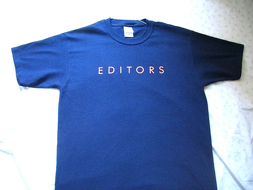
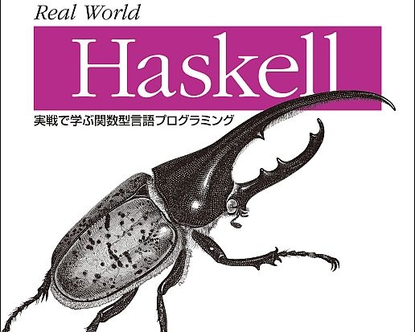
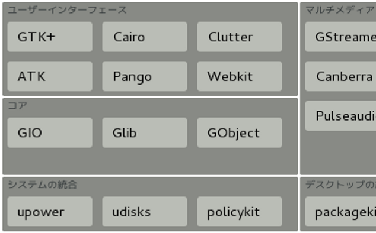
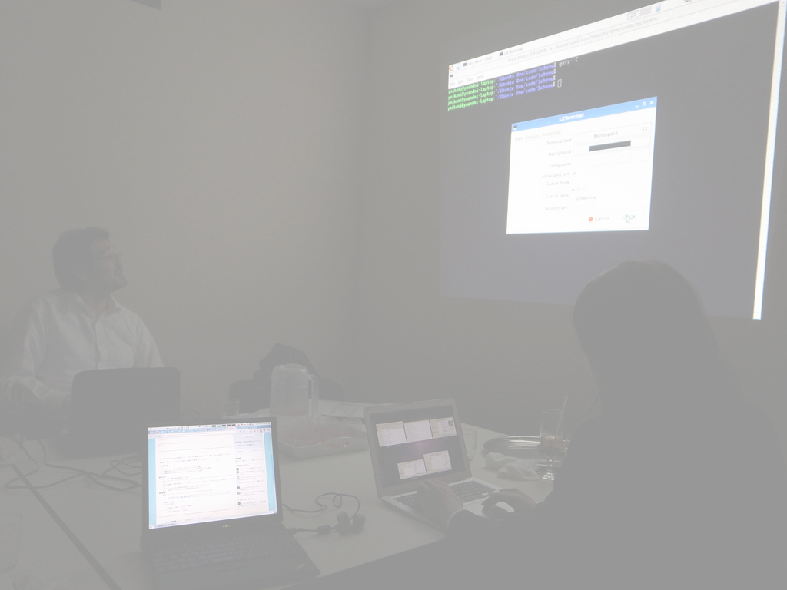

# CairoでほっかりGUIプログラミング

Kiwamu Okabe

# 自己紹介

* twitter: http://twitter/master_q
* 職業: コピペプログラマ
* CとRubyなら使えますが。。。
* Haskellは本腰入れて勉強しはじめて半年

# 「Haskell」への周囲の反応

うちの会社の近辺では。。。

* 何がいいの？
* Haskellで何ができるの？
* 実用になるの？
* 製品に使えるの？

# できますって!

やる気になれば!

# じゃーなんか作りましょうよ

* ゲームとか作れば釣れる？
* とにかくGUIで、なんか。。。

# あ、今日プレゼンやるDEATH

* じゃープレゼンツール作りましょう!
* http://rabbit-shockers.org みたいなの!
* 。。。できました!

https://gitorious.org/carettah ← コレ

# 使い方: プレゼンテキスト書式

↓みたいなテキストファイルを作って

~~~ { .markdown }
# CairoでほっかりGUIプログラミング

Kiwamu Okabe
# 自己紹介

* twitter: http://twitter/master_q ...
~~~

ファイル名sample.mdで保存。

# 使い方: 起動

さっき書いたテキストを食わせるだけ

~~~ { .command }
$ pwd
/home/hogehoge/src/carettah
$ ./carettah sample.md
~~~

すればプレゼン開始。

# モジュール構成

# gtk2hsの使い方

「Real World Haskell」を買ってください!

# cairoとは

# cairoの使い方: 初期化

~~~ { .haskell }
window <- windowNew
canvas <- drawingAreaNew
widgetSetSizeRequest window 640 480
onExpose canvas $ const 描画関数
_ <- window `on` keyPressEvent $ tryEvent $ do
  keyName <- G.eventKeyName
  liftIO $ case keyName of
             "j" -> nextPage >> G.widgetQueueDraw canvas
set window [G.containerChild G.:= canvas]
mainGUI
~~~

# cairoの使い方: 描画

PostScriptみたいな感じです。

~~~ { .haskell }
renderHoge :: Render ()
renderHoge = do
  save
  (surface, w, h) <- pngSurfaceSize "hoge.png"
  setSourceSurface surface 0 0
  paintWithAlpha 0.5
  restore
~~~

# cairo使うときのハマりポイント

* 画面再描画する場合はExposeイベントで
* ↑すればダブルバッファリングは自動実行
* Renderモナド内ではPSっぽい状態がある
* ↑の状態はcanvasで保存してるんじゃない
* utf8文字列を送るときはtoUTF関数を通す 

# pandoc抽象について

~~~ { .haskell }
readMarkdown :: ParserState -> String -> Pandoc
~~~

って関数にmarkdownなテキストを食わせる

~~~ { .haskell }
ghci> readMarkdown defaultParserState "# title\n* item"
Pandoc (Meta {docTitle = [], docAuthors = [], docDate = []})
[Header 1 [Str "title"],
 BulletList [[Plain [Str "item"]]]]
~~~

後はPandoc側を好きな具象に落せばOK

# 宣伝: HaskellやるならDebian!

* Haskell関連パッケージが充実
* apt-cache search libghc- | wc -l #>872
* gtk2hsやcairoもcabal不要ですぐ使えます
* yesodもパッケージになってるよ!

# 宣伝: 「初心者Haskell勉強会」

* レベル: 「プログラミングHaskell」一読
* 日時: 隔週日曜日13時開始
* 場所: 大森 (ニフティさん場所貸して!)
* 内容1: 宿題答えあわせ
* 内容2: 持ち回りでLT
* 2011年8月下旬から再開予定
